# GA Robot User App Business Flow & Operations Map

This document maps the full user-facing business flow and explains how the operations system supports each journey. It is intended for product, operations, design, and engineering alignment.

## Scope

The current app covers these business domains:

- Account and onboarding
- Home discovery and personalized shortcuts
- App preorder for VM pickup
- VM Scan & Pay for machine-side orders
- Wallet eCard, Add Funds, Bonus Balance, and Auto Reload
- Benefits, coupons, vouchers, points, tiers, EXP, and missions
- Gifts: drink voucher and wallet eCard
- Partner offers and partner vouchers
- Activity history: orders, wallet, payments, gifts
- Account settings, payment methods, notification preferences, and QA tools

## End-To-End Business Map

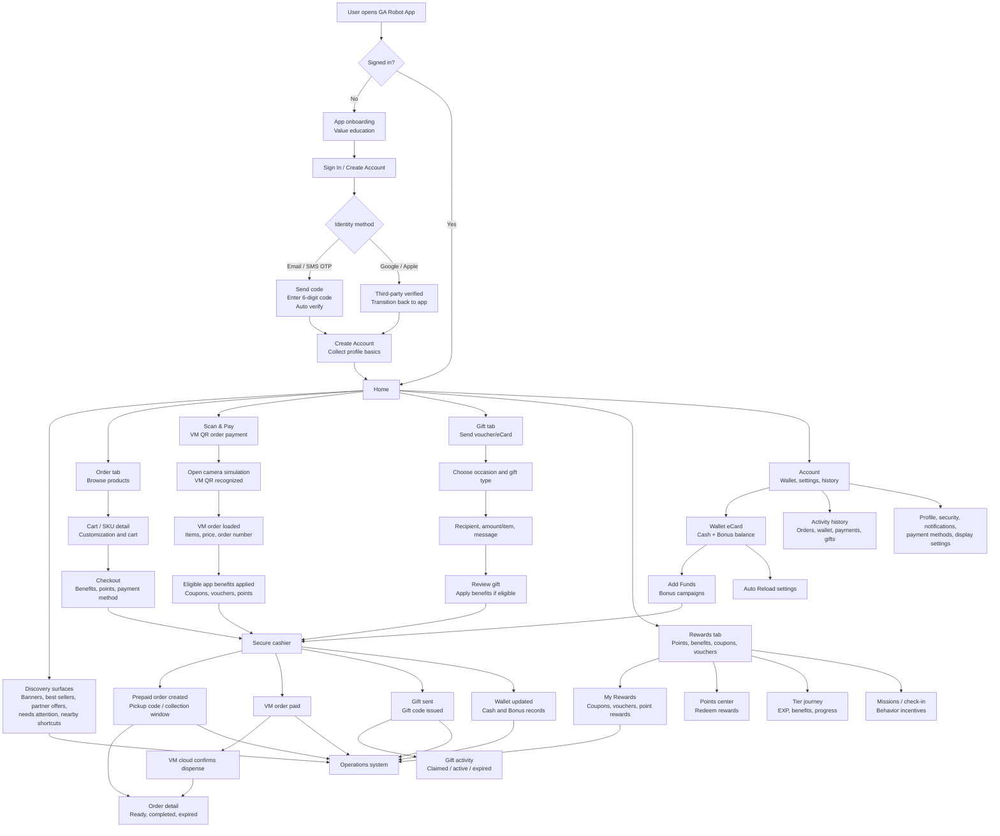

## Operations System Layer

The operations system is not a single page. It is the platform layer that decides what the app shows, what benefits are eligible, how orders move through states, and how the business learns from user behavior.

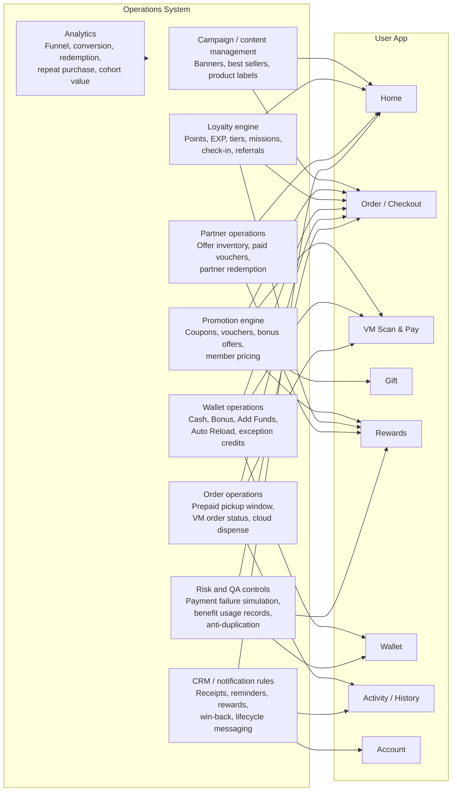

## Core Business Flows

### 1. Account Creation And Login

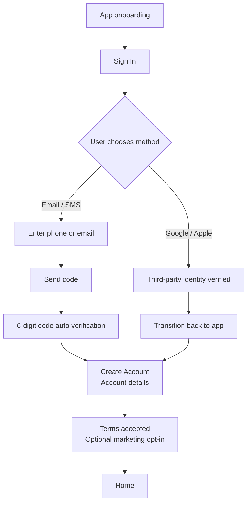

Operations role:

- Defines onboarding value messages and sequencing.
- Supports identity policy: accepted login methods, OTP retry/resend rules, and third-party profile completion requirements.
- Captures consent: terms acceptance, privacy acknowledgement, marketing preference.
- Feeds CRM segmentation: new account, profile completion, marketing opt-in, first-session behavior.

### 2. App Preorder For VM Pickup

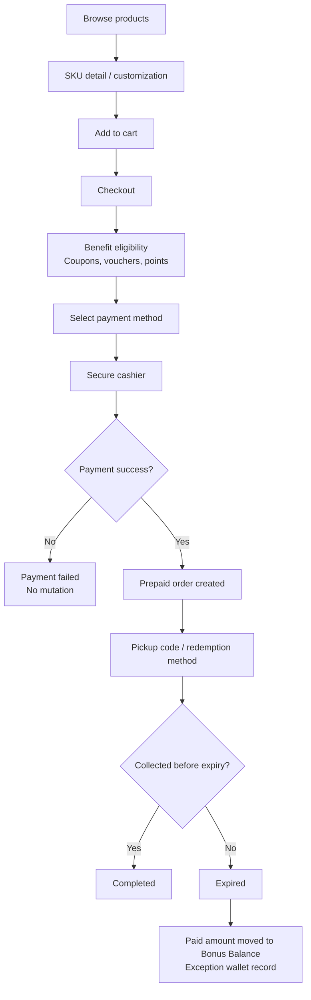

Operations role:

- Manages menu availability, pricing, labels, recommendation priority, and product merchandising.
- Configures benefit rules and prevents duplicate use through benefit usage records.
- Owns pickup policy: collection window, expired order handling, and customer-facing recovery rule.
- Monitors funnel: product view, cart, checkout, payment success, pickup, expiry.
- Creates interventions: pickup reminders, expiring-order alerts, post-expiry service recovery.

### 3. VM Scan & Pay

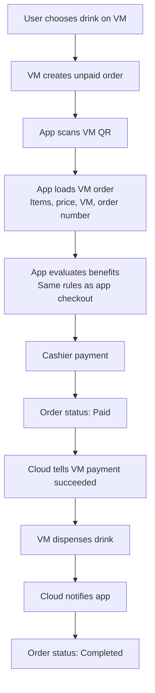

Operations role:

- Synchronizes VM-side order data with app checkout: item, price, machine, order number.
- Applies the same benefit policy as app orders, so users do not lose benefits when paying for VM orders.
- Tracks machine fulfillment status and separates app payment success from VM dispense completion.
- Enables operational monitoring: machine failure, payment without dispense, late cloud callback, order reconciliation.
- Supports local VM campaigns: machine-specific products, campus promos, time-based incentives.

### 4. Wallet, Add Funds, Bonus, And Auto Reload

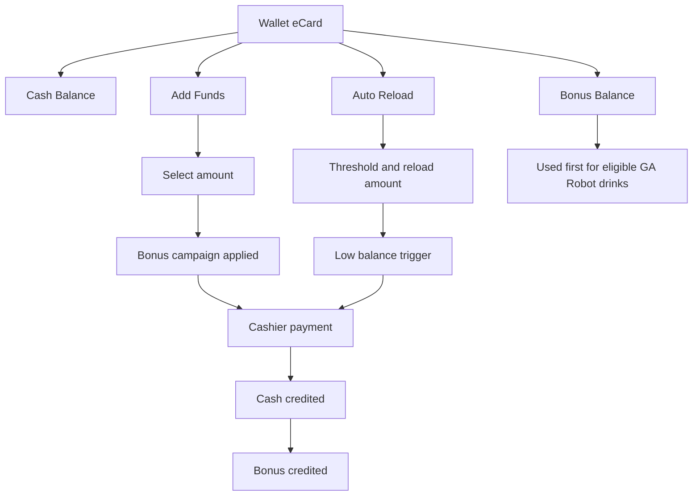

Operations role:

- Configures Add Funds offers: amount, bonus value, reward rate.
- Defines Bonus Balance rules: where bonus can be used, priority of use, and exclusions such as partner purchases.
- Controls Auto Reload thresholds and amounts.
- Tracks liability: cash balance, bonus balance, top-up history, exception credits.
- Drives revenue operations: prepaid wallet adoption, repeat purchase, breakage risk, and bonus ROI.

### 5. Benefits, Rewards, Points, EXP, And Tiers

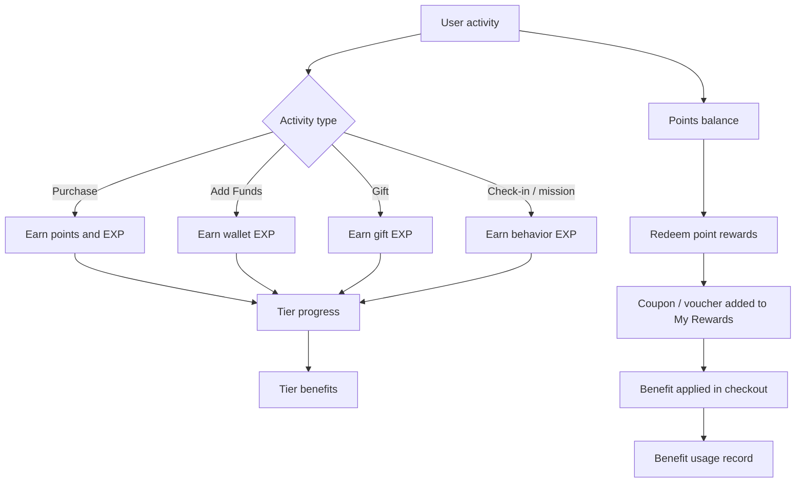

Operations role:

- Defines earn rules: points per dollar, EXP per action, streak bonuses, referral/gift rewards.
- Maintains tiers and benefit packages: Gold, Platinum, Diamond, and member price eligibility.
- Curates point rewards and cost levels.
- Tracks reward lifecycle: active, used, expired.
- Optimizes incentives: which behaviors need missions, which cohorts need bonus offers, which tiers need better retention benefits.

### 6. Gift Flow

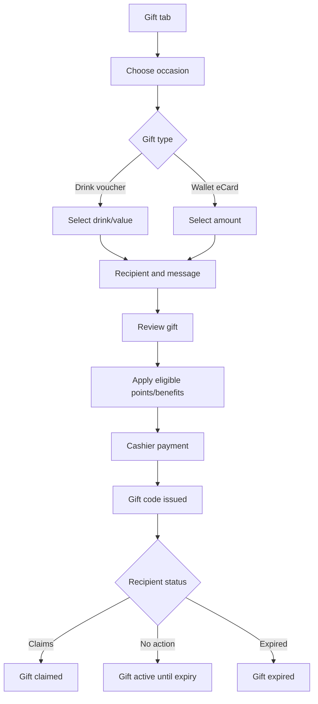

Operations role:

- Defines gift occasions, suggested copy, recommended gift type, and voucher design.
- Controls gift validity, claim rules, and recipient experience.
- Uses gift flow as acquisition: recipient may become a new registered user.
- Tracks sender/recipient graph for referral and CRM.
- Measures viral loop: gift sent, gift opened, gift claimed, first purchase after gift.

### 7. Partner Offers

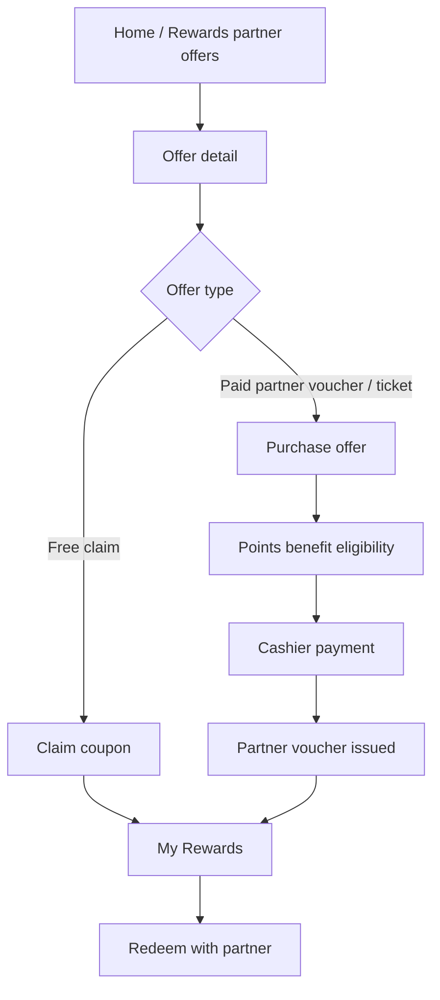

Operations role:

- Manages partner inventory, pricing, claim limits, expiry, and presentation.
- Defines whether partner purchases can use wallet cash, points benefit, or bonus.
- Reconciles partner voucher issuance and redemption.
- Tracks partner performance: impressions, claims, purchases, redemption, repeat visits.
- Supports co-marketing campaigns and sponsored placement on Home.

### 8. Activity, Receipts, And Customer Support

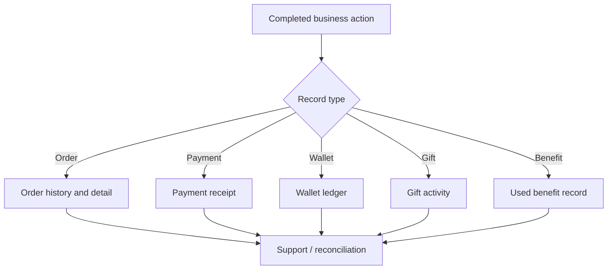

Operations role:

- Provides audit trail for user trust and support resolution.
- Links order numbers, payment IDs, wallet transactions, benefit usage, and gift codes.
- Supports exception workflows: failed payment, expired prepaid order, VM paid but not dispensed, insufficient wallet cash.
- Enables lifecycle messages: receipts, reminders, expiry alerts, completion notifications.

## Operations Touchpoints By Business Flow

| Business flow | User-facing moment | Operations system role | Key data generated |
| --- | --- | --- | --- |
| Onboarding | Value introduction | Defines value proposition order and activation journey | Onboarding completion, skip, sign-in start |
| Login / registration | OTP, Google/Apple, profile completion | Identity policy, consent, CRM segmentation | Identity method, terms acceptance, marketing opt-in |
| Home discovery | Banners, best sellers, partner offers | Campaign ranking, merchandising, personalization | Impression, click, conversion source |
| App preorder | Cart, checkout, pickup code | Menu, pricing, benefits, pickup policy | Order, payment, points, EXP, benefit usage |
| VM Scan & Pay | Pay for VM-selected item in app | VM order sync, benefit eligibility, cloud dispense tracking | VM order, machine, paid status, completed status |
| Wallet / Add Funds | Top up, bonus, auto reload | Wallet liability, bonus rules, top-up campaigns | Cash ledger, bonus ledger, reload setting |
| Rewards | Points, coupons, vouchers | Reward catalog, redemption cost, expiry | Reward issue/use/expiry, points delta |
| Tiers / EXP | Member journey | Earn rules, tier thresholds, benefit unlocks | EXP record, tier state, mission completion |
| Gifts | Send voucher/eCard | Gift catalog, validity, recipient acquisition | Gift code, recipient, claim/expiry status |
| Partner offers | Claim/purchase partner value | Partner inventory, sponsored placement, redemption rules | Partner voucher, payment, redemption |
| Activity / receipts | History and detail | Audit, support, reconciliation | Receipts, ledger, linked IDs |
| Notifications | Reminders and offers | CRM rules and lifecycle messaging | Push/email/SMS event, opt-in state |

## State And Exception Model

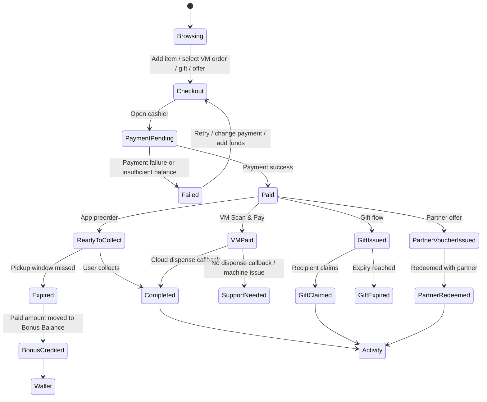

## Recommended Operating Dashboards

To make the operations system actionable, the team should monitor:

- Activation funnel: onboarding completion, sign-in method, profile completion, first order.
- Commerce funnel: product view, cart, checkout, payment success, pickup/dispense completion.
- VM health: scan success, paid orders, dispense callbacks, no-dispense exceptions by machine.
- Wallet health: add funds conversion, auto reload adoption, cash/bonus balance liability.
- Rewards efficiency: coupon claim, voucher redemption, points redemption, benefit usage, expiry.
- Gift loop: gift sent, gift claimed, recipient account creation, recipient first purchase.
- Partner performance: offer impressions, claims, paid purchases, redemption rate, partner revenue.
- Support exceptions: payment failures, expired prepaid orders, VM paid-not-dispensed, insufficient balance attempts.

## Product Implications

- Benefits must be evaluated consistently across app preorder, VM Scan & Pay, and gift/payment flows.
- VM payment status and VM dispense status should remain separate states.
- Bonus Balance needs clear user education because it is not equivalent to cash.
- Activity history is a business-critical audit surface, not just a user convenience page.
- Operations configuration should drive most promotional surfaces instead of hard-coded page logic.
- CRM permissions and notification preferences should map to specific operational events: receipts, pickup reminders, offer campaigns, reward expiry, and support exceptions.

