# GA Robot User App 全业务流程与运营体系图

这份文档用于统一产品、设计、运营、工程和数据团队对 GA Robot User App 的业务理解。重点不是只画用户点击路径，而是说明：每一个用户业务流程背后，运营体系如何配置、驱动、监控和干预。

## 1. 业务范围

当前 App 覆盖的用户业务场景包括：

- 新用户 onboarding、注册、登录、第三方登录、基础资料收集
- Home 发现、营销 banner、待处理提醒、热销商品、合作商家优惠
- App 预点单、购物车、checkout、支付、取货、过期处理
- VM 设备端选品后，App 扫码支付
- VM 地图、附近设备、设备详情、库存和营业状态
- Wallet eCard、Add Funds、Bonus Balance、Auto Reload
- Benefits、优惠券、饮品券、积分兑换、会员等级、EXP、missions
- Gift：饮品券、钱包 eCard、礼品码、领取和过期
- Partner Offers：合作商家券、付费 partner voucher、核销
- Activity：订单、钱包、支付、礼品、权益使用记录
- Account：个人资料、支付方式、通知偏好、隐私、安全、帮助与 QA 工具

## 2. 全局业务地图

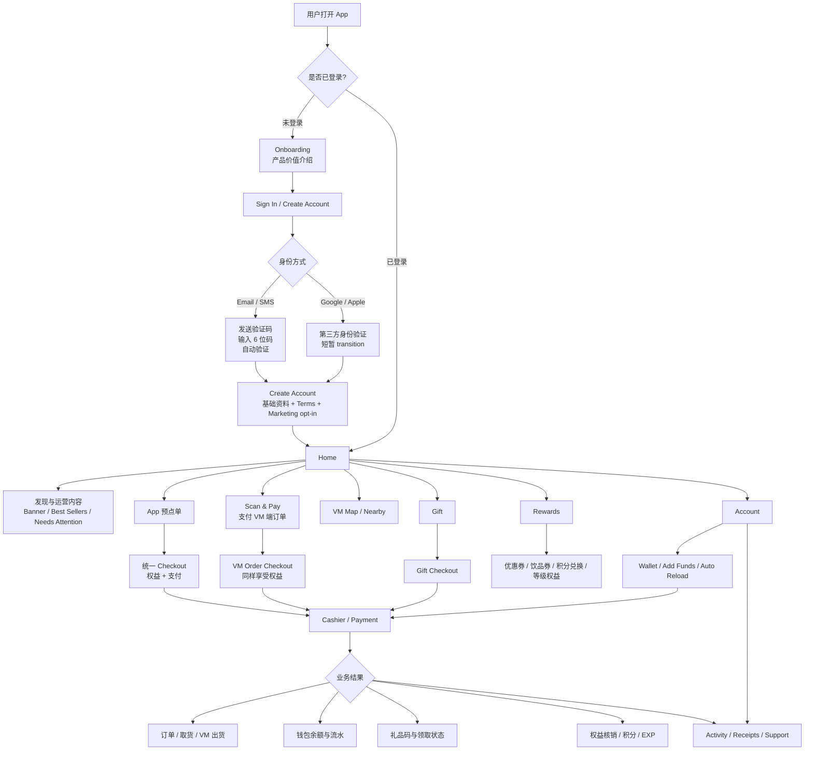

## 3. 运营体系总图

运营体系不是单个页面，而是驱动 App 内容、价格、权益、状态、消息和数据反馈的业务中台。

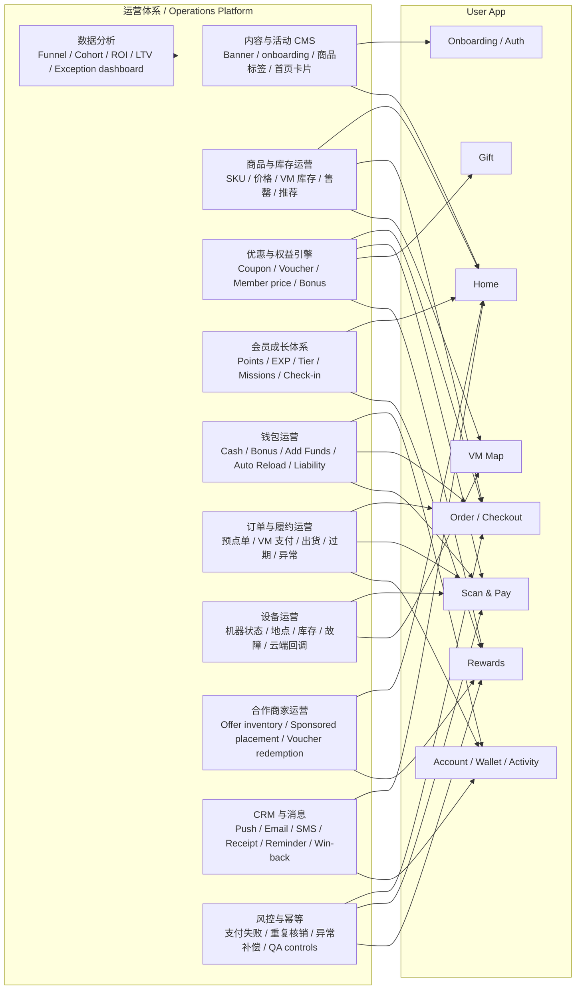

## 4. 核心业务流程

### 4.1 Onboarding / 注册 / 登录

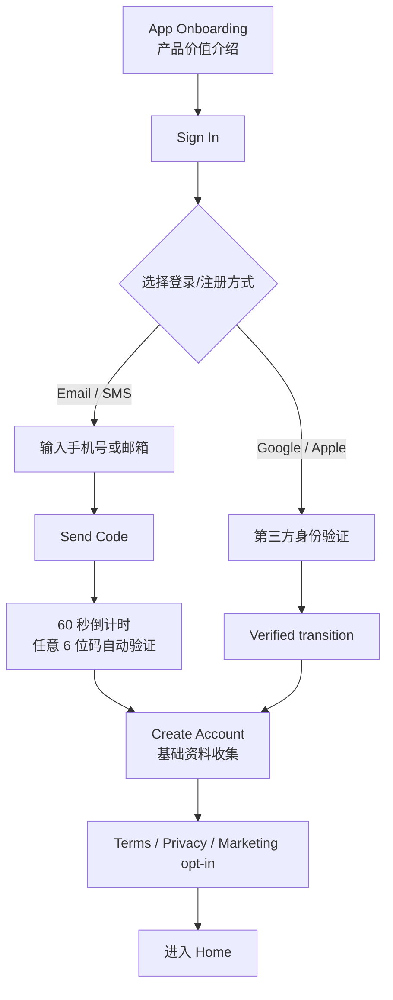

| 运营环节 | 体现方式 | 作用 |
| --- | --- | --- |
| Onboarding 内容运营 | 5-6 页价值介绍、排序、图片、文案 | 教育用户核心价值，降低注册前不确定性 |
| 身份策略 | Email/SMS、Google、Apple、验证码重发规则 | 覆盖北美常见登录习惯，降低注册门槛 |
| Consent 管理 | Terms、Privacy、Marketing opt-in | 满足合规和后续 CRM 授权 |
| 新用户分层 | 来源、登录方式、是否跳过 onboarding、是否 opt-in | 为首单激励、召回和新用户旅程提供数据 |

关键数据：

- onboarding_view、onboarding_next、onboarding_skip
- auth_method_selected、otp_sent、otp_verified、third_party_verified
- profile_completed、terms_accepted、marketing_opt_in

### 4.2 Home 发现与运营内容

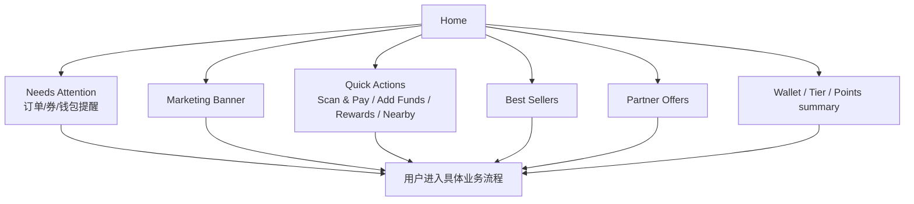

| 运营环节 | 体现方式 | 作用 |
| --- | --- | --- |
| 首页坑位运营 | banner、活动卡、热销 SKU、合作商家位置 | 把运营目标转化成用户入口 |
| 个性化排序 | 新用户、会员等级、余额、过期券、附近 VM | 提升点击率和转化率 |
| Needs Attention | 即将过期券、待取订单、钱包提醒 | 把运营提醒转成用户行动 |
| 内容实验 | banner A/B、CTA 文案、卡片排序 | 优化激活、复购和充值转化 |

关键数据：

- impression、click、source_module、campaign_id
- home_to_checkout、home_to_rewards、home_to_add_funds
- needs_attention_open、needs_attention_resolved

### 4.3 App 预点单 / Pickup Order

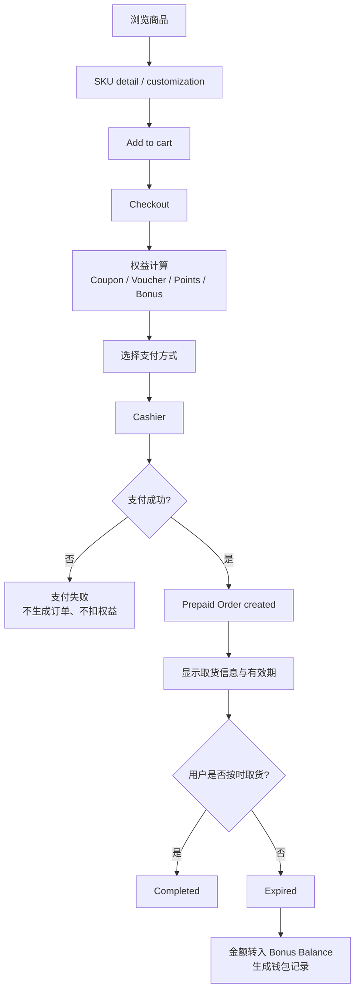

| 运营环节 | 体现方式 | 作用 |
| --- | --- | --- |
| 商品运营 | SKU、价格、标签、图片、库存、售罄 | 决定用户能买什么、看到什么 |
| 价格/权益引擎 | 会员价、券、积分、bonus 使用优先级 | 保证前后端价格一致，避免错算 |
| 订单策略 | pickup window、过期规则、订单状态 | 管理履约承诺和异常处理 |
| CRM 提醒 | 支付成功、取货提醒、即将过期、过期补偿说明 | 降低未取货和投诉 |
| 数据看板 | 商品浏览、加购、支付、取货、过期 | 判断商品和运营活动质量 |

异常重点：

- 支付失败：不生成订单，不扣券，不扣积分
- 库存变化：下单前需要二次校验或锁库存
- 过期未取：按业务规则进入 Bonus Balance，而不是现金退款

### 4.4 VM 设备端选品，App 扫码支付

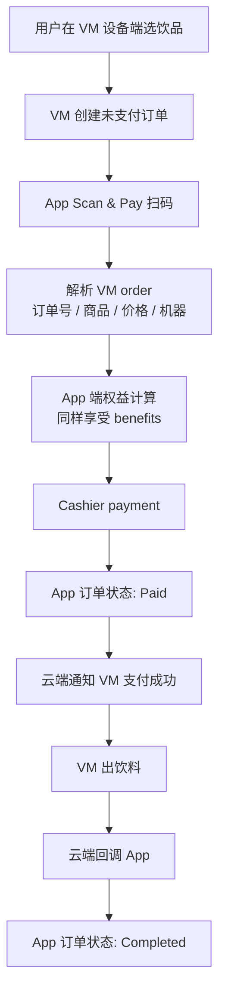

| 运营环节 | 体现方式 | 作用 |
| --- | --- | --- |
| VM 订单同步 | QR 解析 VM order，而不是创建 prepaid order | 保证 App 支付的是设备端真实订单 |
| 权益一致性 | VM app pay 同样使用券、积分、bonus、会员价 | 用户不会因为支付路径不同而损失权益 |
| 设备履约监控 | Paid 和 Completed 分离 | 识别“已付款但未出货”的售后风险 |
| 机器运营 | 机器状态、库存、故障、地点、时段活动 | 支持机器级运营和故障定位 |
| 对账 | VM order number、payment id、dispense callback | 支持财务和客服核查 |

异常重点：

- VM order 过期或被取消：App 应提示重新扫码
- 支付成功但 VM 未出货：进入 support-needed 状态
- 云端回调延迟：App 显示 paid/dispensing，不应直接 completed

### 4.5 VM Map / Nearby

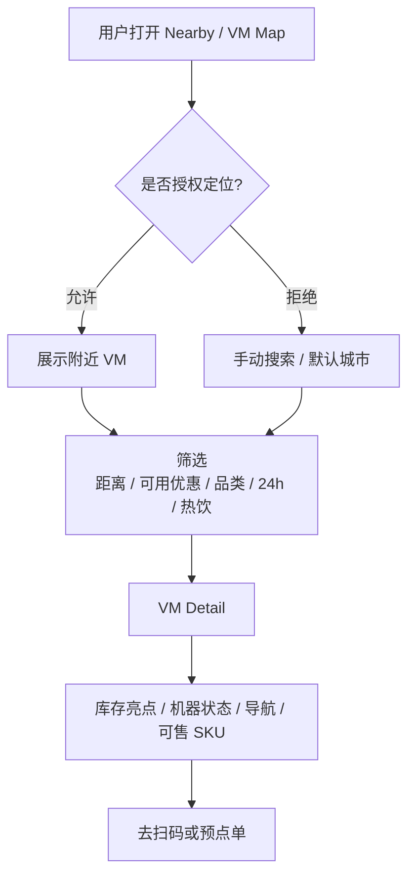

| 运营环节 | 体现方式 | 作用 |
| --- | --- | --- |
| 设备运营 | 机器地理位置、营业状态、故障状态 | 帮用户找到可用机器，降低空跑 |
| 库存运营 | 每台 VM 的可售 SKU 和库存亮点 | 支持按库存推荐和导流 |
| 本地活动 | campus/store/VM 级活动 | 提高特定机器销量 |
| 权限运营 | LBS 授权时机、拒绝态替代路径 | 避免强制授权导致流失 |

### 4.6 Wallet / Add Funds / Bonus / Auto Reload

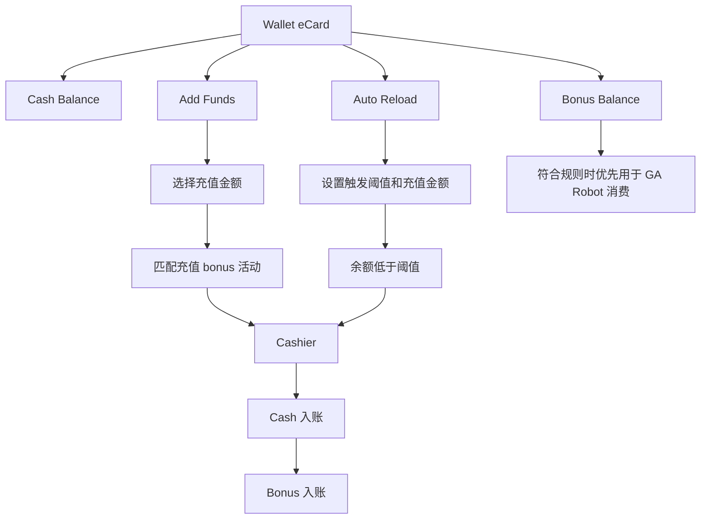

| 运营环节 | 体现方式 | 作用 |
| --- | --- | --- |
| 充值活动 | Add $X get $Y bonus | 提升预付资金和复购 |
| 资金规则 | Cash / Bonus 分账、使用顺序、适用范围 | 控制财务责任和用户预期 |
| Auto Reload | 阈值、金额、默认关闭、授权支付方式 | 提升留存和消费连续性 |
| 钱包流水 | Cash、Bonus、top-up、expired order credit | 支持审计、客服和财务对账 |

异常重点：

- 充值支付失败：不入账
- Bonus 不等于现金，需要明确解释
- 预点单过期金额转 Bonus，需要在 Activity 和 Wallet detail 讲清楚

### 4.7 Rewards / Benefits / Points / EXP / Tier

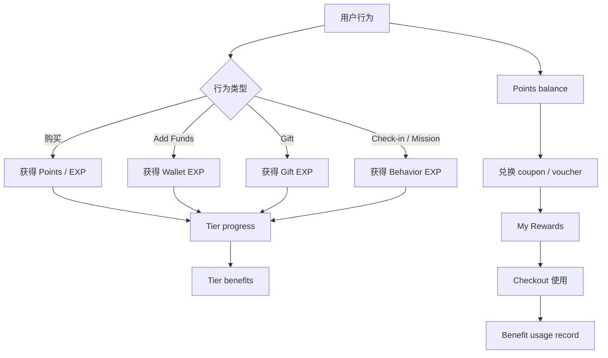

| 运营环节 | 体现方式 | 作用 |
| --- | --- | --- |
| 积分规则 | points per dollar、兑换成本、过期规则 | 管理用户价值感和财务成本 |
| EXP 规则 | purchase、wallet、gift、mission contribution | 引导业务目标行为 |
| Tier 体系 | 等级门槛、权益包、会员价 | 提升长期留存 |
| 权益生命周期 | claimed、active、used、expired | 防止重复使用和用户混淆 |
| 任务运营 | daily check-in、streak、限时任务 | 增加打开频次和复购 |

关键数据：

- points_earned、points_redeemed、exp_earned
- reward_claimed、reward_used、reward_expired
- tier_progress_view、tier_upgraded

### 4.8 Gift：饮品券与 Wallet eCard

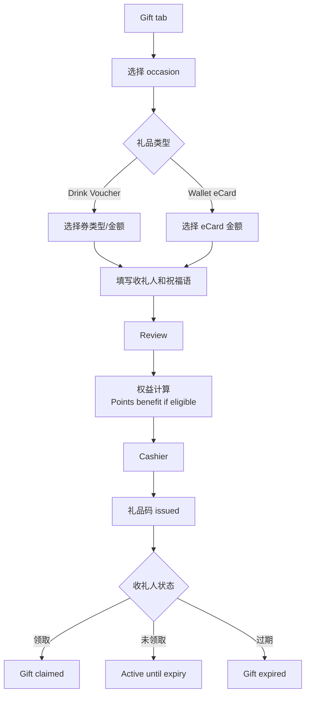

| 运营环节 | 体现方式 | 作用 |
| --- | --- | --- |
| 场景运营 | birthday、exam、thank you、holiday | 提升送礼转化 |
| 礼品 SKU | voucher 类型、eCard 金额、有效期 | 管理商品化礼品 |
| 增长运营 | 收礼人打开、领取、注册、首购 | Gift 是拉新渠道 |
| CRM | 送达提醒、领取提醒、即将过期提醒 | 提高领取率 |
| 风控 | 礼品码唯一、领取幂等、过期状态 | 防止重复领取和客服争议 |

### 4.9 Partner Offers

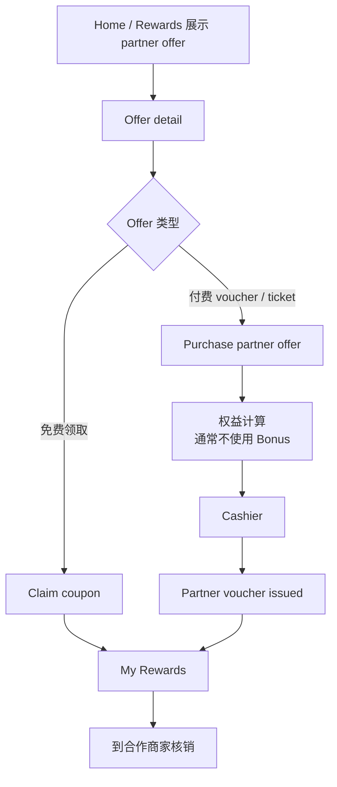

| 运营环节 | 体现方式 | 作用 |
| --- | --- | --- |
| 商家运营 | offer 库存、价格、佣金、展示时段 | 变现和本地生活合作 |
| Sponsored placement | Home / Rewards 推荐位 | 提高商家曝光 |
| 核销规则 | 有效期、使用条件、条码/券码 | 支持商家核销和对账 |
| 数据报表 | impression、claim、purchase、redemption | 给商家和内部运营评估 ROI |

### 4.10 Activity / Receipt / Support

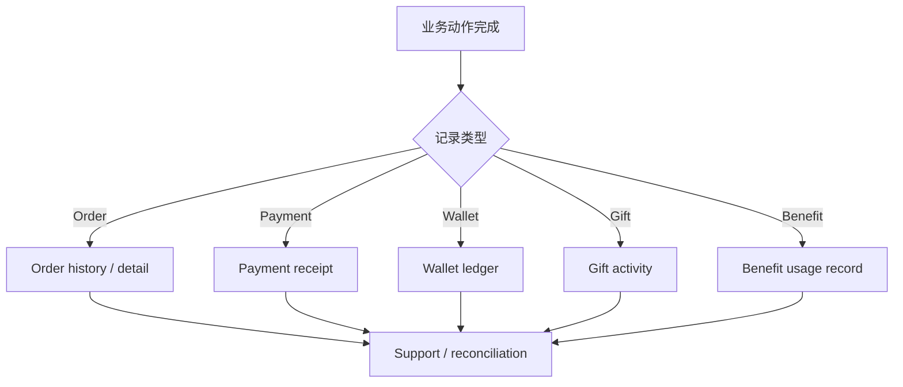

| 运营环节 | 体现方式 | 作用 |
| --- | --- | --- |
| 审计链路 | order number、payment id、wallet transaction、gift code | 支持用户信任和客服处理 |
| 异常售后 | 支付失败、未出货、订单过期、余额不足 | 把复杂问题转成可解释状态 |
| 财务对账 | 订单、支付、钱包、bonus、partner voucher | 降低财务和客服成本 |
| CRM 触发 | receipt、pickup reminder、gift claimed、expiry alert | 用交易事件驱动消息 |

### 4.11 Account / Settings / Permissions

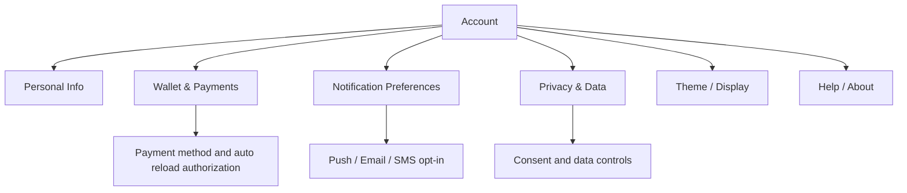

| 运营环节 | 体现方式 | 作用 |
| --- | --- | --- |
| 用户资料 | 姓名、邮箱、手机、邮编、生日 | 支持收据、会员权益、生日活动、地区运营 |
| 通知偏好 | receipt、reward、campaign、support | 合规地做 CRM |
| 隐私合规 | consent、data policy、account id | 满足北美市场基本要求 |
| 支付设置 | 默认支付方式、wallet、auto reload | 支持交易转化和复购 |

## 5. 权益统一计算原则

权益和价格不能散落在不同页面里。所有交易型流程都应该调用同一套价格/权益规则。

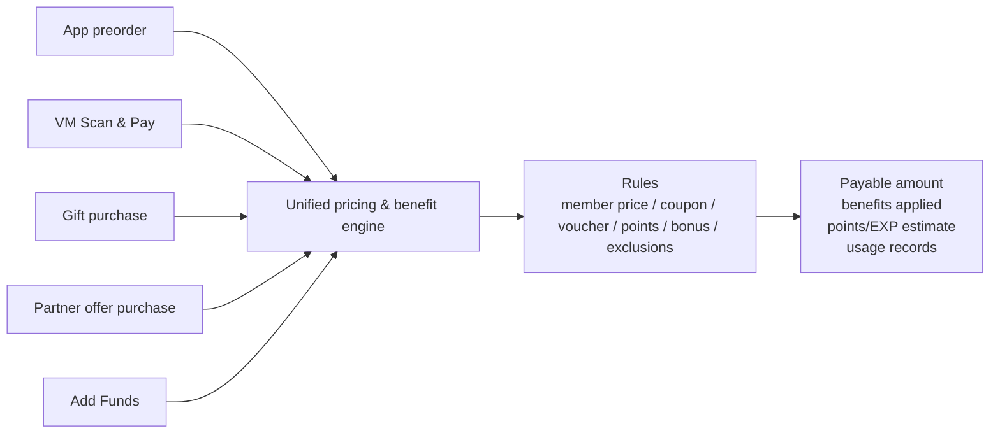

建议原则：

- App 预点单和 VM App Pay 必须使用一致的 coupon、voucher、points、member price 规则。
- Bonus Balance 不是现金，适用范围应明确，通常不应用于 partner purchases。
- Benefit usage record 必须在支付成功后生成，支付失败不应核销。
- Points/EXP 的 earn 和 redeem 需要可追踪，便于客服和数据分析。
- 每一笔 checkout 都应该能解释：原价、优惠、积分、bonus、实付、支付方式。

## 6. 状态与异常模型

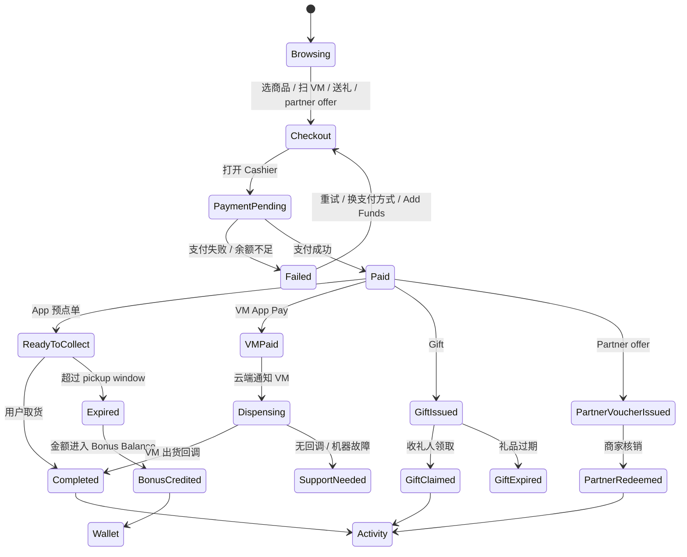

## 7. 运营看板建议

### 激活看板

- onboarding completion rate
- sign-in method distribution
- OTP sent to verified rate
- third-party verified to profile completed rate
- profile completion rate
- first order / first scan / first add funds

### 交易看板

- product impression to detail
- detail to cart
- cart to checkout
- checkout to payment success
- payment success to pickup / dispense completed
- failed payment rate by method

### VM 设备看板

- scan success rate
- QR resolved to paid rate
- paid to dispense callback latency
- paid but not dispensed exceptions
- exception rate by VM
- inventory availability by VM and SKU

### 钱包看板

- Add Funds conversion
- bonus campaign ROI
- auto reload opt-in rate
- cash balance liability
- bonus balance liability
- bonus used / expired / credited from expired orders

### 权益看板

- coupon claim rate
- voucher redemption rate
- points earn / redeem ratio
- reward expiry rate
- benefit usage by checkout type
- tier upgrade and retention by tier

### 礼品看板

- gift started to sent
- gift sent to claimed
- recipient account creation
- recipient first purchase
- gift expired rate

### Partner 看板

- partner offer impression
- claim / purchase conversion
- voucher redemption
- partner revenue
- sponsored placement performance

### 售后与异常看板

- payment failure
- insufficient wallet balance
- expired prepaid orders
- VM paid but not dispensed
- duplicate benefit attempts
- support tickets by root cause

## 8. 业务流程与运营触点总表

| 业务流程 | 用户目标 | 运营体系体现 | 核心配置 | 核心数据 |
| --- | --- | --- | --- | --- |
| Onboarding | 理解产品价值 | 内容运营、激活漏斗 | 页数、图片、文案、排序 | view、next、skip |
| 注册/登录 | 快速进入账户 | 身份策略、consent、CRM 分层 | OTP、SSO、terms、opt-in | method、verified、profile_completed |
| Home | 发现下一步行动 | CMS、个性化、campaign ranking | banner、quick action、best seller | impression、click、source |
| App 预点单 | 提前购买并取货 | SKU、价格、权益、订单运营 | SKU、库存、pickup window | cart、payment、pickup、expired |
| VM App Pay | 为设备端订单付款 | VM order sync、权益统一、设备履约 | QR、VM order、cloud callback | paid、dispensed、machine_id |
| VM Map | 找到可用机器 | 设备运营、库存运营、位置策略 | VM 状态、库存、筛选 | location、vm_detail、navigate |
| Wallet | 管理余额 | 钱包运营、资金规则 | cash、bonus、ledger | balance、top_up、bonus_used |
| Add Funds | 充值拿 bonus | 充值活动、财务责任 | amount、bonus、campaign | conversion、liability |
| Auto Reload | 自动补足余额 | 支付授权、留存运营 | threshold、reload amount | opt_in、triggered |
| Rewards | 使用权益 | 权益引擎、积分、会员等级 | coupon、voucher、points、tier | claim、redeem、use、expire |
| Gift | 给别人送饮品/余额 | 场景运营、拉新、CRM | occasion、gift SKU、expiry | sent、claimed、recipient_first_purchase |
| Partner Offer | 购买/领取合作权益 | 商家运营、核销、赞助位 | offer、inventory、commission | impression、purchase、redeem |
| Activity | 查记录和凭证 | 审计、客服、对账 | receipt、linked IDs | record_open、support_case |
| Notifications | 被提醒和召回 | CRM、生命周期运营 | push/email/SMS rules | delivered、opened、converted |
| Account | 管理资料和偏好 | 合规、支付设置、隐私 | profile、payment、privacy | updated、opt_in、default_payment |

## 9. 产品与工程落地建议

- 把“权益计算”抽象成统一服务，不要在 App preorder、VM pay、Gift、Partner 中各算一套。
- 把 VM payment status 和 VM dispense status 分离，否则无法处理“已付款但未出货”。
- 把 Bonus Balance 的规则写入产品文案和流水详情，避免用户以为它等同现金。
- 把 Activity 做成审计中心，而不只是历史列表；每条记录都应能追溯 order/payment/wallet/benefit/gift code。
- 把 CRM 权限和通知偏好映射到具体业务事件：receipt、pickup reminder、reward expiry、gift claim、support exception。
- 把所有运营坑位都设计成可配置：Home banner、best sellers、partner offers、missions、Add Funds offers。
- 对所有支付成功后的业务动作做幂等：订单创建、权益核销、积分入账、礼品码发放、partner voucher issuing。

